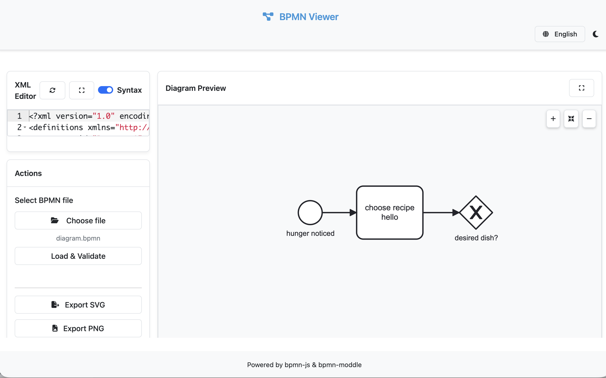
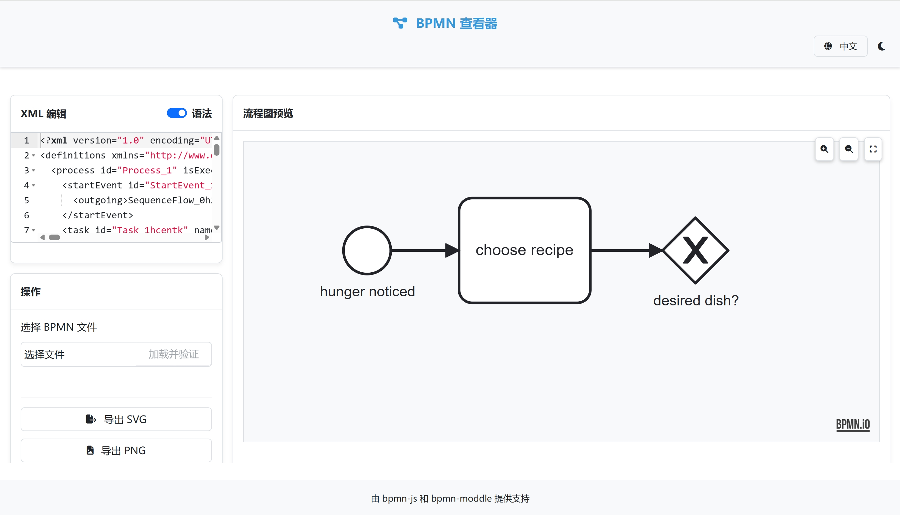
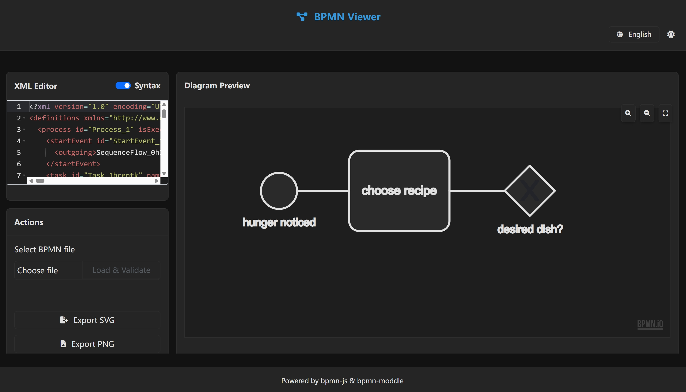

# BPMN Viewer | BPMN 查看器

[English](#english) | [中文](#中文)

## English

### Introduction
BPMN Viewer is a lightweight, user-friendly web application for viewing and validating BPMN 2.0 (Business Process Model and Notation) diagrams. It provides an intuitive interface for users to load, view, and export BPMN diagrams.

### Key Features
- **File Support**: Open and validate BPMN (.bpmn) and XML (.xml) files
- **Drag & Drop**: Seamlessly drag and drop files directly into the viewer for instant rendering
- **Interactive Viewing**: 
  - Pan and zoom controls
  - Smooth mouse wheel zooming
  - Drag to move the diagram
  - Fit to viewport option
- **Export Options**: 
  - Export diagrams as SVG
  - Export diagrams as PNG
- **XML Editor**: 
  - Built-in XML editor with syntax highlighting
  - Real-time sync from Editor to Canvas
  - Toggle syntax highlighting on/off
- **Theme Support**: 
  - Light/Dark mode switch
  - Automatic theme synchronization across components
- **Multilingual**: 
  - English/Chinese language support
  - Real-time language switching
- **Lane Management**: 
  - Automatic lane label adjustment
  - Optimized label positioning and visibility
- **Error Handling**: 
  - Comprehensive file validation
  - Clear error messages and warnings
- **Chrome Extension Support**: 
  - Seamless integration with Chrome browser
  - Settings synchronization

### Usage
1. Drag and drop a `.bpmn` or `.xml` file directly into the window, OR click "Choose file" to select one.
2. The diagram will load and validate automatically.
3. Use mouse to pan and zoom:
   - Drag to move the diagram
   - Use mouse wheel to smoothly zoom in/out
   - Use zoom buttons in the corner
4. Edit the XML directly in the editor and click "Sync to Canvas" (<i class="fas fa-sync-alt"></i>) to see changes instantly.
5. Use the toolbar to:
   - Switch between light/dark themes
   - Change language
   - Toggle syntax highlighting
   - Export diagram as SVG/PNG

### Technical Details
- Built with modern web technologies
- Uses bpmn-js for BPMN rendering
- Ace editor for XML editing
- Responsive design for various screen sizes
- Local storage for user preferences

---

## 中文

### 简介
BPMN 查看器是一个轻量级、用户友好的 Web 应用程序，用于查看和验证 BPMN 2.0（业务流程模型和标记法）图表。它为用户提供了直观的界面来加载、查看和导出 BPMN 图表。

### 主要特点
- **文件支持**：打开并验证 BPMN (.bpmn) 和 XML (.xml) 文件
- **拖拽上传**：支持将文件直接拖拽到窗口中，实现即时渲染
- **交互式查看**：
  - 平移和缩放控制
  - 丝滑的鼠标滚轮缩放
  - 拖拽移动图表
  - 自适应视口选项
- **导出选项**：
  - 导出为 SVG 格式
  - 导出为 PNG 格式
- **XML 编辑器**：
  - 内置 XML 编辑器，支持语法高亮
  - 支持将代码修改**实时同步**到右侧画布
  - 可切换语法高亮显示
- **主题支持**：
  - 明暗主题切换
  - 组件主题自动同步
- **多语言支持**：
  - 支持中文/英文
  - 实时语言切换
- **泳道管理**：
  - 自动调整泳道标签
  - 优化标签位置和可见性
- **错误处理**：
  - 全面的文件验证
  - 清晰的错误和警告提示
- **Chrome 扩展支持**：
  - 与 Chrome 浏览器无缝集成
  - 设置同步功能

### 使用方法
1. 将 BPMN 或 XML 文件**拖拽**到当前窗口中，或者点击"选择文件"进行选择。
2. 文件将被自动加载并验证。
3. 使用鼠标进行平移和缩放：
   - 按住左键拖动可移动图表
   - 使用**鼠标滚轮**进行平滑缩放
4. 在左侧编辑器中直接修改 XML，然后点击“同步到画布” (<i class="fas fa-sync-alt"></i>) 按钮，可立即预览修改结果。
4. 使用工具栏：
   - 切换明暗主题
   - 切换语言
   - 开关语法高亮
   - 导出 SVG/PNG 格式

### 技术细节
- 使用现代 Web 技术构建
- 使用 bpmn-js 进行 BPMN 渲染
- 使用 Ace 编辑器进行 XML 编辑
- 响应式设计，适配各种屏幕尺寸
- 使用本地存储保存用户偏好设置

